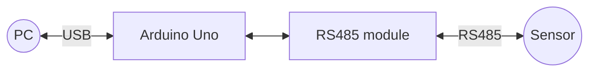

# RS485 Bridge

This code is an Arduino sketch that creates a simple RS485 bridge.

This code creates a simple RS485 bridge that allows a PC to communicate with a device, for instance a sensor, using the RS485 protocol through the USB serial communication.

The code includes the following features:

- It uses the SoftwareSerial library to create a serial communication interface for the RS485 bus.
- The baud rate for both the USB serial communication and the RS485 communication is defined as 4800.

## Supported Boards

### Arduino AVR

#### Pins

| RS485 module           | Arduino Pin |
|:------------------|:------------|
| DE (Data Enable) | 3           |
| RE (Receive Enable) | 4           |
| DI | 5      |
| RO | 2      |

## Code Explanation

- In the `setup()` function, the USB serial communication is initialized, the control pins for the RS485 are set as outputs, and the RS485 serial communication is initialized.
- The `setRs485ReceiveMode()` function sets the DE and RE pins to LOW, enabling the RS485 receiver.
- The `setRs485TransmitMode()` function sets the DE and RE pins to HIGH, enabling the RS485 transmitter.
- In the `loop()` function, the code checks if data is available on the RS485 bus. If data is available, it reads the data and sends it to the USB serial communication.
- The code also checks if data is available on the USB serial communication. If data is available, it enables the RS485 transmit mode, reads the data, and sends it to the RS485 bus. After sending the data, the RS485 receiver mode is enabled again.

## Baud rate

| Module                  | Config      |
|:------------------------|:------------|
| Halisense TH-EC-pH-NPK  | 4800 8N1    |
| Sensirion SHT3x         | 9600        |
